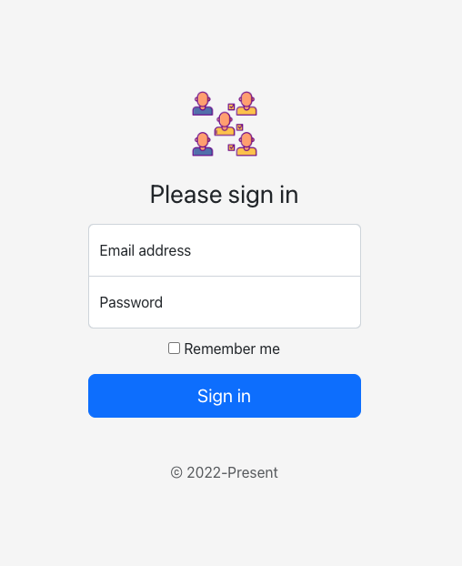

# react-mallog

React login form in bootstrap

```shell
$ npm install bootstrap@5.2.0-beta1 @schoi-godaddy/react-mallog

...
```

- In `App.css`

```css
html,
body,
#root {
  height: 100%;
}

#root {
  display: flex;
  align-items: center;
  padding-top: 40px;
  padding-bottom: 40px;
  background-color: #f5f5f5;
}

.form-signin {
  max-width: 330px;
  padding: 15px;
}

.form-signin .form-floating:focus-within {
  z-index: 2;
}

.form-signin input[type='email'] {
  margin-bottom: -1px;
  border-bottom-right-radius: 0;
  border-bottom-left-radius: 0;
}

.form-signin input[type='password'] {
  margin-bottom: 10px;
  border-top-left-radius: 0;
  border-top-right-radius: 0;
}
```

- In `App.tsx`

```typescript

import React from 'react';
import "bootstrap/dist/css/bootstrap.min.css";
import { Form } from "@schoi-godaddy/react-mallog";
import './App.css';

function App() {
  return (
    <Form
      logoImageUrl="image url or path"
      onCheckBoxChange={...}
      onEmailChange={...}
      onFormSubmit={...}
      onPasswordChange={...}
      onSignInClick={...}
    />
  );
};
```



## DISCLAIMER ⚠️

PLEASE DO NOT USE THIS - This package is for demo purpose.

## Deploy

```shell
$ npm run rollup
...

$ npm publish
...
```

## Citations

- https://dev.to/alexeagleson/how-to-create-and-publish-a-react-component-library-2oe
- https://getbootstrap.com/
