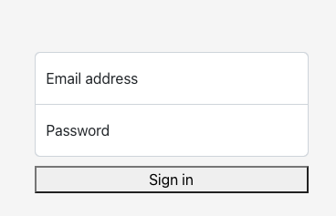

# react-mallog

React login form in bootstrap

ex)

## DISCLAIMER ⚠️

PLEASE DO NOT USE THIS - This package is for demo purpose.

## Citations

- https://dev.to/alexeagleson/how-to-create-and-publish-a-react-component-library-2oe
- https://getbootstrap.com/
